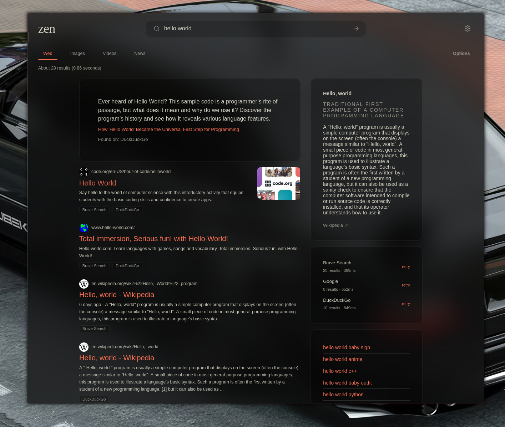
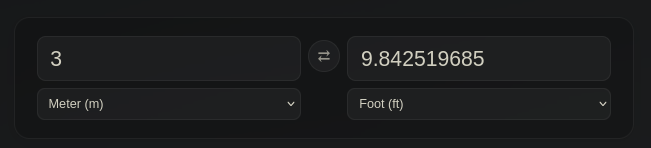
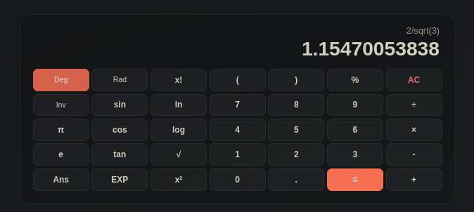

# degoog extensions

Custom theme and plugins for the homelab degoog instance.

## Usage

Add this repo URL in **Settings → Store → Add**:

```
https://github.com/HasNate618/degoog-extensions.git
```

Install the theme from **Settings → Themes** and the plugin from **Settings → Plugins**.

## 🎨 Themes

### zen




## 🔌 Plugins

### Unit Converter

`!convert` or `!c` — interactive unit converter widget with auto-detection. Converts length, mass, volume, temperature, digital storage, speed, area, and currency.



**Auto-detection**: search `100m to feet`, `5 kg to lb`, or `30°C to F` and the widget appears above results.

**Command**: `!convert 5ft to m` or `!c 100 usd to eur`.

All units are two-way — type on either side, swap with the ⇄ button, or change dropdowns to recompute.

### Keyboard Navigation

`!hotkeys` — navigate search results from the keyboard.

| Key | Action |
|-----|--------|
| `j` / `k` | Next / previous result (stops at ends) |
| `o` / `Enter` | Open selected result |
| `t` | Open result in new tab |
| `q` | Close tab |
| `Escape` | Blur search bar / deselect result |
| `g` / `G` | Scroll to top / bottom (selection preserved) |
| `y` | Copy result URL to clipboard |

All keys are ignored while typing in an input field.

### Calculator

`!calc` — interactive scientific calculator with auto-detection. Auto-detects math queries like `2+2`, `sin(30)`, `5!`, or `ln(e)`. Features Deg/Rad angle mode, Inv trig toggle, constants (π, e), factorial, EXP notation, and Ans recall.



**Auto-detection**: search `2+2`, `sin(45)`, `sqrt(144)`, `5!`, `10*π`, `ln(e)`, `2^8`, or `1/0` — the calculator appears above search results.

**Command**: `!calc 2+2`, `!calc sin(30)^2+cos(30)^2`, or just `!calc` for an empty calculator.

Buttons build the expression; each digit or function updates the result live. `=` evaluates the full expression, `AC` clears, `Ans` recalls the last result. `Deg`/`Rad` and `Inv` are toggle buttons with visual state.
